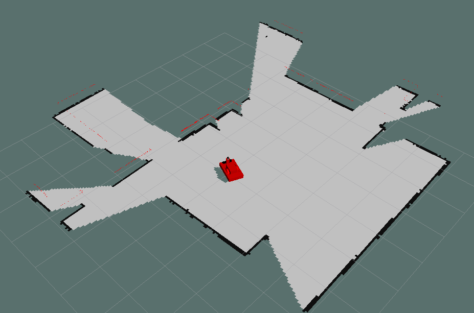
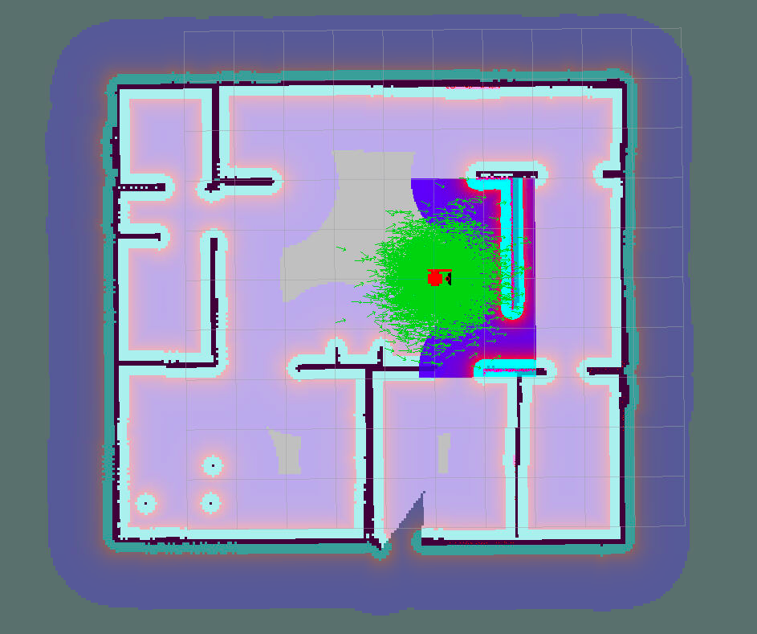
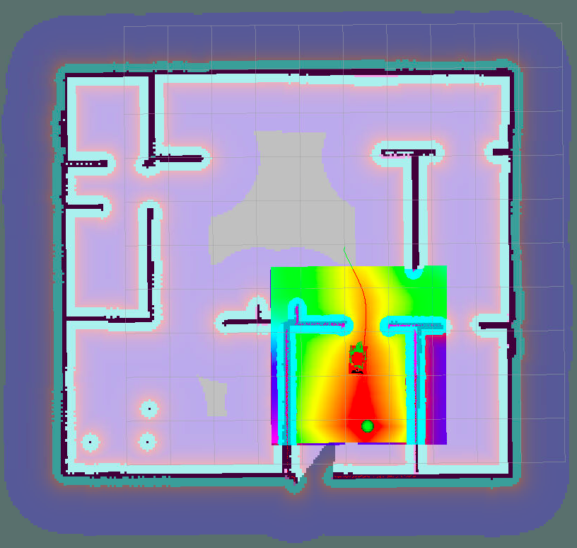
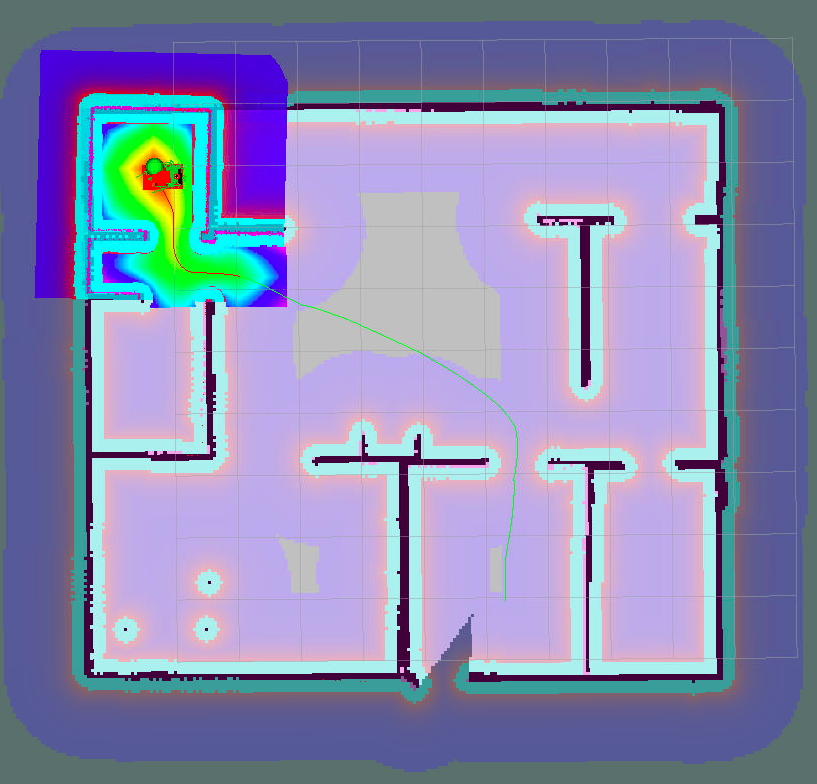

# The robot environment mapping project

This project is aimed at localization and navigation of a robot in the mapped environment. The robot moves to an object to pick up it and then moves to the target goal location for picking down the object.

The robot has a 2D lidar and RGB-D sensor onboard. The robot's environment has been mapped by [ROS gmapping package](http://wiki.ros.org/gmapping) which provides laser-based SLAM (Simultaneous Localization and Mapping). The robot navigation task is accompanied by AMCL (Adaptive Monte Carlo Localization) package (see [description in](http://wiki.ros.org/amcl)) and [ROS move_base package](http://wiki.ros.org/move_base), which provides functionality for reaching a goal by the robot. The robot local navigation task is performed by [ROS DWA local planer](http://wiki.ros.org/dwa_local_planner).

Within the project the Rviz tool is used for sensors data, the robot's navigation trajectory, navigation maps and cost maps visualization. A visualization of the robot environment is provided by the [Gazebo tool](http://gazebosim.org/).


## Installation

The code has been tested on ROS kinetic (1.12.14) version with Ubuntu 16.04, however, it was tested on the latest ROS noetic version with Ubuntu 20.04 too. For the last one, instead of using the ROS turtlebot teleop package, you should use [ROS turtlebot3 package](http://wiki.ros.org/turtlebot3_teleop).

There is assumed that ROS and Gazebo are installed on your machine under Ubuntu linux. There are some tutorials [how to setup Gazebo](http://gazebosim.org/tutorials?tut=install_ubuntu) and [install ROS (Noetic)](http://gazebosim.org/tutorials?tut=install_ubuntu) on your host.

The code of the repository should be placed into your catkin workspace path in `src` directory.

For the first time you should install dependencies of the project (please, sure that `rosdep` tool is [installed](http://wiki.ros.org/rosdep) on your system):

Ensure to setup your workspace paths:
```console
source your_catkin_workspace_path/devel/setup.bash
```

Install all dependencies for the project:
```console
rosdep install --from-paths src --ignore-src -r -y
```

Build the project:
```console
cd your_catkin_workspace_path
catkin_make
```

In no errors appeared, you are ready!

## File structure of src directory

```bash
./src
|-- CMakeLists.txt -> /opt/ros/kinetic/share/catkin/cmake/toplevel.cmake
|-- README.md
|-- add_markers
|   |-- CMakeLists.txt
|   |-- package.xml
|   |-- src
|   |   `-- add_markers.cpp
|   `-- srv
|       |-- DeleteMarker.srv
|       `-- SetMarker.srv
|-- images
|-- map
|   |-- my_world.pgm
|   `-- my_world.yaml
|-- my_robot
|   |-- CMakeLists.txt
|   |-- config
|   |   |-- base_local_planner_params.yaml
|   |   |-- costmap_common_params.yaml
|   |   |-- global_costmap_params.yaml
|   |   |-- local_costmap_params.yaml
|   |   `-- rviz_config.rviz
|   |-- launch
|   |   |-- amcl.launch
|   |   |-- gmapping_test.launch
|   |   |-- robot_description.launch
|   |   `-- world.launch
|   |-- maps
|   |   |-- my_map.pgm
|   |   `-- my_world.yaml
|   |-- meshes
|   |   |-- hokuyo.dae
|   |   |-- kinect.dae
|   |   `-- kinect.png
|   |-- package.xml
|   |-- urdf
|   |   |-- my_robot3.gazebo
|   |   `-- my_robot3.xacro
|   `-- worlds
|       |-- empty.world
|       `-- my_world.world
|-- pick_objects
|   |-- CMakeLists.txt
|   |-- include
|   |   `-- pick_objects
|   |       `-- object_picker_library.h
|   |-- launch
|   |-- package.xml
|   `-- src
|       |-- object_picker_library.cpp
|       |-- pick_objects.cpp
|       `-- pick_objects_demo.cpp
|-- rvizConfig
|-- scripts
|   |-- add_markers.sh
|   |-- home_service.sh
|   |-- pick_objects.sh
|   |-- test_navigation.sh
|   `-- test_slam.sh
|-- slam_gmapping
|   |-- README.md
|   |-- ...
|-- turtlebot
|   |-- LICENSE
|   |-- ...
|-- turtlebot_interactions
|   |-- README.md
`-- turtlebot_simulator
    |-- README.md
    |-- ...
```

## Mapping the environment

Even the environment map is available by default and it can be found in `map` subdirectory you can try to make a new map by yourself.

Run bash script `scripts/test_slam.sh`
```console
cd ./src
./scripts/test_slam.sh
```
Now you can teleop the robot (viewing it in Gazebo and Rviz). The Rviz tool shows you how carefully the environment is sensed by the robot.


If you are aimed at creating a new map, you should save your mapping results by the command:
```console
rosrun map_server map_saver -f your_catkin_workspace_path/src/map/your_map_name
```
Be sure in this case to provide the corret map file name in `my_robot/launch/amcl.launch` file in parameter named as `map_file` for further use.

## Navigation

If you are interested in seeing how the robot acts in local and global planning maps, you may run the script file `test_navigation.sh`:
```console
cd ./src
./scripts/test_navigatio.sh
```



This script shows (in Rviz) the robot in its environment. A cloud of green arrows around the robot are particles of AMCL, they provide hypotheses of the robot current location on the map.  The coloured local window around the robot in Rviz shows an estimated local path for the robot's motions. The local window is provided by the ROS DWA local planer. It has its own parameter set used in this project:

```bash
DWAPlannerROS:
  max_vel_x: 0.3 #0.5
  min_vel_x: 0.0 #0.01
  max_vel_theta: 1.5 #1.5
  max_vel_trans: 0.7

  min_in_place_vel_theta: 0.1
  max_vel_rot: 0.8
  min_vel_rot: 0.1

  acc_lim_theta: 1.0
  acc_lim_x: 1.5
  acc_lim_y: 1.5

  sim_time: 1.5

  vx_samples: 3.0
  vy_samples: 10.0
  vtheta_samples: 20.0

  occdist_scale: 0.05

  path_distance_bias: 32
  goal_distance_bias: 12
  
  forward_point_distance: 0.15
  stop_time_buffer: 2.0
  scaling_speed: 0.25
  max_scaling_factor: 0.2

  publish_cost_grid_pc: true
  publish_cost_grid: true
  publish_traj_pc: true
  meter_scoring: true
  xy_goal_tolerance: 0.25
  yaw_goal_tolerance: 0.1
  latch_xy_goal_tolerance: true
```

If you are interested to tune or making your configurations, please, edit `my_robot/config/base_local_planner_params.yaml` file.

## Achieving the goal locations

The script `scripts/pick_objects.sh` demonstrates the robot ability to achieve two consequent goal locations on the map. There are no markers used to show the object to pick up and pick down.

To make changes for the robot's goal locations, you should edit `pick_objects/src/pick_objects.cpp` file, and change these lines of code:

```
 vector<goalStruct> my_goals;
  goalStruct g1{0.5, -4.15, 1.0};
  goalStruct g2{-5.31, 2.99, 1.0};
```
where the first value is x-coordinate, the second y-coordinate, and the third one theta - the robot's orientation. After editing, do not forget to re-build the project.

One of the ways to determine new locations of the new goals is to use Rviz tool `2D Nav goal` (the button at the top of Rviz's window) by clicking on desired goal location on the map, and at the same time echoing the topic by the command:

```
rostopic echo /move_base/current_goal
```

## Picking object

The script `scripts/home_service.sh` in full fashion demonstrates how the robot picks up the object, then picks down it on the final goal location.



